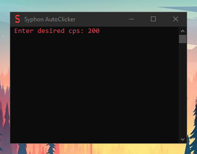
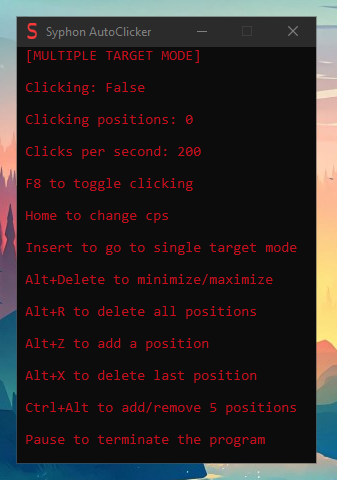

# Syphon AutoClicker

**this is my first C++ project.**

**this autoclicker can go up to 5000 clicks per second.**
**it doesn't support custom hotkeys but i might add them in the future.**

**the reason i made this is because i wanted to specify how many clicks per second i want and not just the delay in milliseconds like some other autoclickers.**

